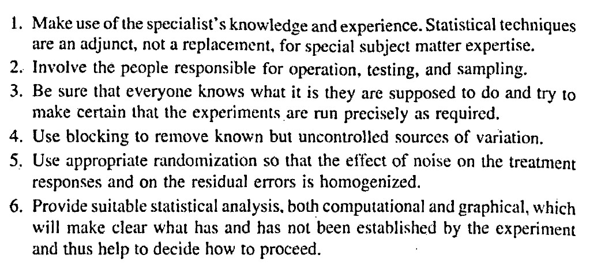

# Designed Experiments Review      
August 27th  

## Announcements

- [Assignment 1](https://stat870.github.io/fall2025/assignments/Assignment1_YourLastName.pdf) is due next Monday. 
- Applied Linear Mixed Models Workshop 09/13-09/14 

## Designed experiments  

Designed experiments are data-generating processes under **controlled** settings. 

The golden rules of designed experiments: 

- Replication 
- Randomization 
- Local control 

```{r echo=FALSE, fig.cap="Principles for conducting valid and efficient experiments. From Box, Hunter and Hunter (2005).", out.width = '80%', fig.align='center'}

```


### Treatment structure

- Solely about the treatment. 
- Most likely connected to the research question and thus defined by the subject matter expert.  

```{r echo=FALSE, fig.cap="Schematic representation of a one-way treatment structure.", out.width = '80%', fig.align='center'}
knitr::include_graphics("../figures/trtdesigns_oneway.PNG")
```

A one-way treatment structure means that the expected value of the observations, $y$, is affected by one treatment factor with $k$ levels:   

$$g(\mu_{ij}) = \eta_{ij} = \eta_{0} + T_i,$$
where:

- $\mu_{ij}$ is the expected value of $y_{ij}$, the observation of the $i$th treatment and $j$th repetition, 
- $g(\cdot)$ is the link function, that ensures that the mean is within the support of the chosen distribution, 
- $\eta_{ij}$ is the linear predictor of $g(\mu_{ij})$, 
- $\eta_{0}$ is the overall mean, and 
- $T_i$ is the effect of the $i$th level of the treatment $T$. 

```{r echo=FALSE, fig.cap="Schematic representation of a two-way factorial treatment structure.", out.width = '80%', fig.align='center'}
knitr::include_graphics("../figures/trtdesigns_twoway.PNG")
```

A two-way treatment structure is similar to a one-way treatment structure, only now the expected value is affected by two treatment factors:   

$$g(\mu_{ijk}) = \eta_{ijk} = \eta_{0} + T_i + G_j + (TG)_{ij} ,$$
where:

- $\mu_{ijk}$ is the expected value of $y_{ij}$, the observation of the $i$th treatment $T$, $j$th treatment $G$, and $k$ repetition, 
- $g(\cdot)$ is the link function, that ensures that the mean is within the support of the chosen distribution, 
- $\eta_{ijk}$ is the linear predictor of $g(\mu_{ijk})$, 
- $\eta_{0}$ is the overall mean,  
- $T_i$ is the effect of the $i$th level of the treatment $T$, 
- $G_j$ is the effect of the $j$th level of the treatment $G$, and 
- $(TG)_{ij}$ is the interaction between the $i$th level of treatment $T$, and $j$th level of treatment $G$. 

```{r echo=FALSE, fig.cap="Schematic representation of a tree-way factorial treatment structure.", out.width = '80%', fig.align='center'}
knitr::include_graphics("../figures/trtdesigns_threeway.PNG")
```

### Design structure  

- You'll notice that the models above only consider the treatment sources of variability to explain variations in the observed values. 
- How were the treatments above (logistically) applied? 

**Useful questions:** 

- What is the experimental unit?  
- What is the blueprint of the design? (which observations are similar to what) 

## Applied example: fungicide effects on barley genotypes   

Let's consider an experiment that aimed to study the effect of fungicide and barley genotypes on grain yield. The study includes two levels of fungicide, and 70 different genotypes, considering all their possible combinations. 

- What is the treatment structure of the experiment?
- Do we know the design structure of the experiment?

**Now, the actual experiment was run like this:** 

```{r warning=FALSE, message=FALSE}
library(tidyverse)
library(agridat)
library(lme4)
library(emmeans)
```

```{r echo=TRUE}
df_fungicide <- agridat::durban.splitplot

df_fungicide %>% 
  ggplot(aes(bed, row))+
  # geom_tile(aes(fill = block))+
  geom_tile(aes(fill = fung))+
  # geom_tile(aes(fill = gen))+
  geom_tile(aes(), color = "black", fill = NA)
```

- What is the treatment structure? 
- What are the experimental units? 
- How many independent observations per treatment factor? 
- What is the design structure? 


## Homework & Announcements  

- Submit [Assignment 1](https://stat870.github.io/fall2025/assignments/Assignment1_YourLastName.pdf) by next Monday. 
- Applied Linear Mixed Models Workshop is full. Email me if you still want to join. 

