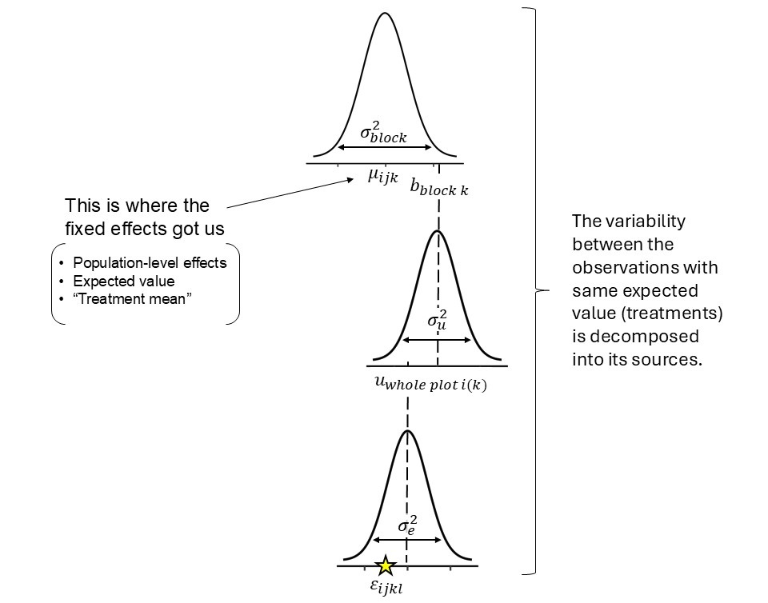

# Linear mixed models  

September 10th 

## Announcements

- [Assignment 2](https://stat870.github.io/fall2025/assignments/Assignment2_YourLastName.pdf) is due today!  


## Linear mixed models  

Mixed models come in handy when the (in)famous independence assumption cannot be taken for granted, especially if we know the dependence patterns in the data. 
We typically know the dependence patterns in the data when running an experiment. 
For example, the fungicide-barley experiment. 
Let's re-do the statistical model and ANOVA shell:

A reasonable model could be 

$$y_{ijk}|b_k, u_{i(k)} \sim N(\mu_{ijk}, \sigma_e^2),$$

$$\mu_{ijk} = \eta_{ijk},$$
$$\eta_{ijk} = \eta_0 + F_i +G_j + (FG)_{ij}+b_k+ u_{i(k)},$$

where: 

- $y_{ijk}$ is the observed yield for the $i$th fungicide treatment, $j$th genotype treatment, and $k$th repetition, 
- $\mu_{ijk}$ is the expected value for the $i$th fungicide treatment, $j$th genotype treatment, and $k$th repetition,  
- $\sigma^2$ is the residual variance, 
- $\eta_{ijk}$, the linear predictor is equivalent to the expected value because the link function is the identity function, 
- $\eta_0$ is the overall mean of the linear predictor, 
- $F_i$ is the effect of the $i$th fungicide treatment, 
- $G_j$ is the effect of the $j$th genotype treatment, 
- $(FG)_{ij}$ is the interaction for the $i$th fungicide treatment and $j$th genotype treatment, 
- $b_k$ is the effect of the $k$th block, $b_k \sim N(0, \sigma^2_b)$
- $u_{i(k)}$ is the effect of the whole plot corresponding to the $i$th fungicide treatment in the $k$th block, $u_{i(k)} \sim N(0, \sigma^2_u)$. 


A reasonable ANOVA shell could be: 

```{r echo=FALSE, message=FALSE, warning=FALSE}
t_crd <- data.frame(
  Source = c("-", "Fungicide", "-", "Genotype",
             "Fung x Gen", "Error", "Total"),
  df = c("-", "f-1 = 1", 
         "-", 
         "g-1 = 69", "(f-1)(g-1) = 69",
         "N-fg = 420", "N-1"))

knitr::kable(t_crd, caption = "This would be the ANOVA under a CRD.")


t_spl <- data.frame(
  Source = c("Block", "Fungicide", "Fungicide(Block)", "Genotype",
             "Fung x Gen", "Gen(Block x Fung)", "Total"),
  df = c("b-1", "f-1", 
         "(b-1)(f-1)", 
         "g-1", "(f-1)(g-1)",
         "f(b-1)(g-1)", "N-1"))

knitr::kable(t_spl, caption = "ANOVA table for the fungicide-barley split-plot design. See also Table 24.9 from Milliken and Johnson as a helpful reference.")


t_spl <- data.frame(
  Source = c("Block", "Fungicide", "Fungicide(Block)", "Genotype",
             "Fung x Gen", "Gen(Block x Fung)", "Total"),
  df = c("3", "1", 
         "3", 
         "69", "69",
         "414", "559"))

knitr::kable(t_spl, caption = "ANOVA table for the fungicide-barley split-plot design.")
```

Notice that the 420 degrees of freedom (aka independent observations) from the CRD ANOVA are now spread across different levels, connected to different variance components: blocks, whole plots, and random error. 
This means that there is a different number of independent observations for Fungicide compared to Genotype. 
The variance components will affect the inference distinctly:

- Standard errors for comparisons at the whole plot: $se(\mu_{i\cdot}-\mu_{i'\cdot}) = \sqrt{\frac{2(\sigma^2_e + g\sigma^2_u)}{gb}}$ 
- Standard errors for comparisons at the split plot: $se(\mu_{\cdot j}-\mu_{\cdot j'}) = \sqrt{\frac{2 \sigma^2_e }{fb}}$ 


Let's apply that model:

```{r}
library(lme4)

# load the data 
url <- "https://raw.githubusercontent.com/stat870/fall2025/refs/heads/main/data/fung_barley_sp.csv"
fung_sp <- read.csv(url)

fung_sp %>% 
  ggplot(aes(bed, row))+
  coord_fixed()+
  theme_minimal()+
  geom_tile(aes(fill = fung))+
  geom_tile(aes(), color = "black", fill = NA)

# fit the model
m <- lmer(yield ~ fung*gen + (1|block/fung), data = fung_sp)

# anova
car::Anova(m, type = 2, test.statistic = "F")
```

### Why do we call these multi-level models?  

The data are clustered in *groups* that were generated under similar conditions. 

- What are those groups in the barley example? 


```{r echo=FALSE, fig.cap="Intuitive visualization of a split-plot design model as a hierarchical (multilevel) model.", out.width = '85%', fig.align='center'}

```


### Degrees of freedom in a mixed model  

Degrees of freedom for means are not that easy and straightforward to compute under mixed models anymore. 
There are **approximate methods** to calculate the degrees of freedom, like Satterthwaite or Kenward-Roger. 

```{r}
mg_means <- emmeans(m, ~fung:gen)
head(mg_means)
```

However, computing the degrees of freedom for the comparisons is much more straightforward (esp. because this a balanced design). 

- Take a look at the ANOVA table, and the experimental units. 

```{r}
sigma2_e <- sigma(m)^2
sigma2_wp <- as.data.frame(VarCorr(m))[1,]$vcov
sigma2_b <- as.data.frame(VarCorr(m))[2,]$vcov
levels_wp <- dplyr::n_distinct(fung_sp$fung)
levels_sp <- dplyr::n_distinct(fung_sp$gen)
reps <- dplyr::n_distinct(fung_sp$block)
```

Differences between levels of the factor at the whole plot -- $se(\mu_{i\cdot}-\mu_{i'\cdot}) = \sqrt{\frac{2(\sigma^2_e + g\sigma^2_u)}{gb}}$. 

```{r}
# get the s.e. for comparisons between fungicide treatments by hand
sqrt( 2*(sigma2_e + levels_sp*sigma2_wp) / (levels_sp*reps))

emmeans(m, ~fung, contr = list(c(1, -1)))$contr
```

Differences between levels of the factor at the split plot -- $se(\mu_{\cdot j}-\mu_{\cdot j'}) = \sqrt{\frac{2 \sigma^2_e }{fb}}$. 

```{r}
# get the s.e. for comparisons between genotype treatments by hand
sqrt( 2*(sigma2_e ) / (levels_wp*reps))

emmeans(m, ~gen, contr = list(c(1, -1, rep(0, 68))))$contr
```


## Next week

- Monday: shrinkage, use of BLUPs versus BLUEs, REML  
- Wednesday: GLMMs 

