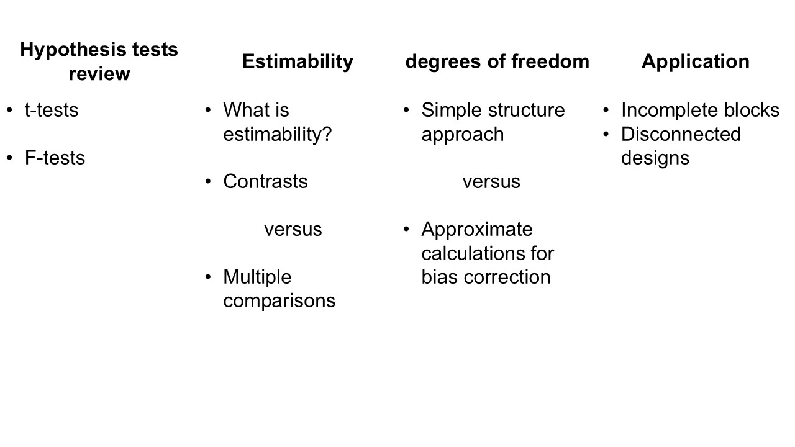

# Inference -- Estimability, degrees of freedom, hypothesis tests, contrasts

## Announcements 

- Highlight questions from Assignment 3:
  - Why are degrees of freedom not always integer numbers?
  - What is the difference between sums of squares? 
  - What is the best size of blocks when designing an experiment? 
  

```{r echo=FALSE, fig.cap="Overview of today's class.", out.width = '80%', fig.align='center'}

```


## Review: Hypothesis tests, t-tests, F tests 

### Hypothesis tests 

- Classic statistics have been deeply associated to falsifiability in the advancement of Science.  
- Hugely influenced by [Karl Popper](https://en.wikipedia.org/wiki/Karl_Popper), the advancement of Science can be understood as a string of hypotheses that are constantly evaluated. 
- In statistics, hypothesis tests evaluate whether a given statistic (i.e., a function of the data) is too extreme for the null hypothesis to be true. 
- Normally, the null hypothesis is business as usual, and we want to evaluate if we just made a scientific discovery, or if there's not enough evidence to say that there's something different going on. 

```{r echo=FALSE, fig.cap="Types of errors in hypothesis tests.", out.width = '80%', fig.align='center'}
knitr::include_graphics("../figures/error_types.jpg")
```

### On p-values 

- The p value is the probability of observing the [t/F] statistic under the null hypothesis. 
- Often, we assume $\alpha = 0.05$, and reject $H_0$ if $p<\alpha$. 
- [ASA's statement on p-values](https://www.amstat.org/asa/files/pdfs/p-valuestatement.pdf) 
- [Scientists rise up against statistical significance](https://www.nature.com/articles/d41586-019-00857-9) 
  - [Discussion](https://statmodeling.stat.columbia.edu/2019/03/20/retire-statistical-significance-the-discussion/) 
  - Counterargument: [In defense of p-values](https://esajournals.onlinelibrary.wiley.com/doi/10.1890/13-0590.1) 
- Gelman "Let us have the serenity to embrace the variation that we cannot reduce, the courage to reduce the variation we cannot embrace, and the wisdom to distinguish one from the other." [[see talk](https://www.youtube.com/watch?v=KS3yPw91iC0&t=3252s)] 


### t-tests 

- Usually used to test whether **one** value/parameter/linear combination of parameters is different to a certain number. 
- Steps: 
  1. Define the target quantity $\theta$. For example, $\theta = \beta_1-\beta_2$. 
  2. After observing the data, estimate $\hat{\boldsymbol\beta}$ and $se(\hat{\boldsymbol\beta})$. 
  3. Calculate the test $t$ statistic as $t^\star = \frac{\hat\theta}{se(\hat\theta)}$. 
  4. Compare $t^{\star}$ to $t_{1-\frac{\alpha}{2}, dfe}$. 

- Why $t$ distribution? $N$ for known se, $t$ for $\hat{se}$. 
- Note that $t^\star$ depends on: 
  - sample size ($dfe$) 
  - experiment design (other df) 
  - the variability $\sigma^2$ associated to that system. 
- Note that $t_{crit}$ depends on $dfe$. 

### F-tests are multivariate t-tests 

- Test the relevance of multiple factors at once. 
- Consistent with the "bins" concept of ANOVA. 
- Usually used to test whether **a group** of factor is relevant to explain variability in the data. 
- Why $F$ distribution? Ratio between two independent $\chi^2$ distributions divided by their df.  
- Steps: 
  1. Calculate Mean Squared Errors for the different sources of variability $= \frac{SSH}{df}$. 
  2. Calculate the F statistic as the ratio between mean squares, $=\frac{MSH}{MSE}$. 
  3. Compute $P(F>F^\star)$, using the degrees of freedom of both mean squares, df of the numerator and df of the denominator.  

- Note, again, the relationship between the p value and sample size and $\sigma^2$. 
- Note, again, that the $P(F>F^\star)$ depends on the df of the denominator. 


## Applied example 

*From Milliken and Johnson (2009).* 

A baker wanted to determine the effect that the amount of fat in a recipe of cookie dough would have on the texture of the cookie. 
She also wanted to determine if the temperature (°F) at which the cookies were baked would have an influence on the texture of the surface. 
The texture of the cookie is measured by determining the amount of force (g) required to penetrate the cookie surface. 

**Experimentation:** 

The process she used was to make a batch of cookie dough for each of the four recipes every day, and baked them one by one in the oven in different batches. 
She carried this process out each of four days when she baked cookies at three different temperatures. 

```{r message=FALSE, warning=FALSE}
library(tidyverse)
library(lme4)
library(emmeans)

df <- read.csv("../data/cookies.csv")
df$Temperature <- as.factor(df$Temperature)
df$fat_perc <- as.factor(df$fat_perc)
df$Day <- as.factor(df$Day)

df %>% 
  ggplot(aes(Temperature, force))+
  theme_classic()+
  scale_fill_manual(values = c("#DCD6F7", "#B4869F", "#985F6F", "#4E4C67"))+
  labs(x = "Temperature (°F)", fill = "Fat (%)", y = "Force (g)")+
  theme(aspect.ratio = .5)+
  geom_boxplot(aes(group = paste(Temperature, fat_perc),
                   fill = factor(fat_perc)))
```

**ANOVA table for cookie RCBD** 

<head>
    <meta charset="UTF-8">
    <meta name="viewport" content="width=device-width, initial-scale=1.0">
    <title>ANOVA table for cookie RCBD</title>
    <style>
        table {
            width: 100%;
            border-collapse: collapse;
            margin: 20px 0;
        }
        th, td {
            border: 1px solid #ddd;
            padding: 8px;
            text-align: left;
        }
        th {
            background-color: #f4f4f4;
            font-weight: bold;
        }
        tr:nth-child(even) {
            background-color: #f9f9f9;
        }
    </style>
</head>

<body>

<table>
    <tr>
        <th>Source</th>
        <th>df</th>
    </tr>
    <tr>
        <td>Block</td>
        <td>$r-1 = 3$</td>
    </tr>
    <tr>
        <td>Temp</td>
        <td>$t-1 = 2$</td>
    </tr>
    <tr>
        <td>Fat</td>
        <td>$f-1 = 3$</td>
    </tr>
    <tr>
        <td>$T \times F$</td>
        <td>$(t-1)(f-1) = 6$</td>
    </tr>
    <tr>
        <td>Error</td>
        <td>$N-tf-(r-1) = 33$</td>
    </tr>

</table>
</body>


The corresponding model is 
$$y_{ijk} = \mu + T_i + F_j + TF_{ij} + d_k + \varepsilon_{ijk} , \\
d_k \sim N(0, \sigma^2_d), \\
\varepsilon_{ijk} \sim N(0, \sigma^2_\varepsilon), $$

and can be fitted to the data with the following R code:

```{r}
m <- lmer(force ~ 1 + Temperature*fat_perc + (1|Day), data = df)
```

The degrees of freedom for the denominator are straightforward. 

### t-test 

- **Objective**: compare treatment means between 375 degrees temperature and 4% fat and 400 degrees temperature and 4% fat. 
- Remember $t^\star = \frac{\hat\theta}{se(\hat\theta)}$ 
- $\hat\theta = \mu_{22} - \mu_{32}$ 
- $se(\hat\theta) = \sqrt{\frac{2 \sigma^2_\varepsilon}{r}}$

<details>
<summary>R code to get t statistics by hand</summary>

```{r}
d <- data.frame(Temperature = as.factor(c(375, 400)), 
                fat_perc = factor(4))
hat.mu <- predict(m, newdata = d, re.form = NA)
hat.theta <- hat.mu[2]-hat.mu[1]
```

```{r}
hat.sigma2 <- sigma(m)^2
hat.sigma2_b <- as.data.frame(VarCorr(m))[1,4]
reps <- n_distinct(df$Day)
se.hat.theta <- sqrt((2* hat.sigma2)/reps)
```

```{r}
emmeans(m, ~Temperature:fat_perc, contr = list(c(0, 0, 0, 
                                                 0, -1, 1, 
                                                 rep(0, 6))))$contrasts
```

```{r}
hat.theta
se.hat.theta

t.star <- hat.theta/se.hat.theta
t.star

dt(t.star, df = 33)
```

</details>


### F-test 

- **Objective**: find out if temperature, in general, affects the texture of the cookie. 
- $H_0:$ all temperatures have the same effect on texture.  
- $H_a:$ at least one temperature has a different effect on texture. 
- $F^\star = \frac{MS_{Temp}}{MS_{resid}}$ 
- $F_{critical} = F_{1-\alpha, df_{numerator}, df_{denominator}}$

<details>
<summary>R code to get t statistics by hand</summary>

```{r message=FALSE, warning=FALSE}
m.full <- lmer(force ~ 1 + Temperature*fat_perc + (1|Day), data = df) 
m.TF <- lmer(force ~ 1 + Temperature + fat_perc + (1|Day), data = df)
m.T <- lmer(force ~ 1 + Temperature + (1|Day), data = df)
m.F <- lmer(force ~ 1 + fat_perc + (1|Day), data = df)
m.n <- lmer(force ~ 1 + (1|Day), data = df)

# SS II residual 
sum(resid(m.full)^2)

# SS II TxF 
sum((predict(m.full, re.form = NA) - predict(m.TF, re.form = NA))^2)

# SS II F 
sum((predict(m.TF, re.form = NA) - predict(m.T, re.form = NA))^2)

# SS II T 
sum((predict(m.TF, re.form = NA) - predict(m.F, re.form = NA))^2)
```

```{r}
# P(F>Fcrit) for temperature
F.T <- (179.5317/2)/(26.44833/33)
1 - pf(F.T, df1 = 2, df2 = 33)

# P(F>Fcrit) for fat%
F.F <- (3.665/3)/(26.44833/33)
1 - pf(F.F, df1 = 3, df2 = 33)

# P(F>Fcrit) for TxF
F.TF <- (1.505/6)/(26.44833/33)
1 - pf(F.TF, df1 = 6, df2 = 33)
```
</details>


## Estimability 

- A quantity is estimable if it is possible to find a linear combination of the data that provides an unbiased and unique estimate of that quantity. 
- For matrix models, linear estimable functions of $\boldsymbol\beta$ take on the form of linear combinations of the parameter vector such as $a'\boldsymbol\beta$ where a is a $p\times1$ vector of constants. A linear function $a'\boldsymbol\beta$ is estimable if and only if there exists a vector $r$ such that $a = \mathbf{X}'\mathbf{X}r$. Each function $x_i'\boldsymbol\beta$ is estimable where $x_i$ is the $i$th row of $\mathbf{X}$. 

### Contrasts 

- Linear combinations of parameters. 
- Often connected to hypothesis tests where $H_0: \mathbf{K}\boldsymbol\beta = 0$. 

### Adjusting degrees of freedom for mixed models 

- Contrasts for balanced \& complete designs have straightforward calculation of degrees of freedom. 
- Sometimes, estimating the df is not as straightforward. 
- For unbalanced designs, incomplete blocks, missing data, and cases with more complex variance-covariance structure, the ANOVA sheel do not give us exact degrees of freedom. 
- Downward bias of the variance of an estimable function, leading to: 
  - too narrow confidence intervals 
  - inflated type I error rates 

**Satterthwaite approximation**  

- [Paper](https://www.jstor.org/stable/3002019?seq=1)  

Let $\frac{X^2_{num}/\nu_1}{X_2^\star/\nu^\star_2}$ be the ratio of interest, where $X_{num}^2 \sim \chi^2_{\nu_1}$ and $X_2^\star$ is a linear combination of chi-square random variables all independent of $X_{num}^2$, then $X_2^\star \sim$ approximately $\chi^2_{\nu^\star_2}$, where

$$\nu_2^\star \equiv \frac{(\sum_m c_m X_m^2)^2}{\sum_m\frac{(c_m X_m^2)}{df_m}}.$$

**Kenward-Roger approximation** 

- [Paper](https://www.jstor.org/stable/2533558?seq=1) 
- Again, expept for variance-component-only LMMs with balanced data and their compound symmetry marginal model equivalents, the estimated covariance of $\beta \mathbf{K}$ will tend to be underestimated. 
- KR somewhat more conservative than Satterthwaite. 
- Integrated in most statistical software. 

## Applied example II  

*From Milliken and Johnson (2009).* 

A baker wanted to determine the effect that the amount of fat in a recipe of cookie dough would have on the texture of the cookie. 
She also wanted to determine if the temperature (°F) at which the cookies were baked would have an influence on the texture of the surface. 
The texture of the cookie is measured by determining the amount of force (g) required to penetrate the cookie surface. 

**Experimentation:** 

The process she used was to make a batch of cookie dough for each of the four recipes every day, and baked one cookie from each recipe in the oven together. 
She carried this process out each of four days when she baked cookies at three different temperatures. 

<head>
    <meta charset="UTF-8">
    <meta name="viewport" content="width=device-width, initial-scale=1.0">
    <title>ANOVA table for the cookie split-plot experiment.</title>
    <style>
        table {
            width: 100%;
            border-collapse: collapse;
            margin: 20px 0;
        }
        th, td {
            border: 1px solid #ddd;
            padding: 8px;
            text-align: left;
        }
        th {
            background-color: #f4f4f4;
            font-weight: bold;
        }
        tr:nth-child(even) {
            background-color: #f9f9f9;
        }
    </style>
</head>

<body>

<table>
    <tr>
        <th>Source</th>
        <th>df</th>
    </tr>
    <tr>
        <td>Block</td>
        <td>$r-1 = 3$</td>
    </tr>
    <tr>
        <td>Temperature</td>
        <td>$t-1$ = 2</td>
    </tr>
    <tr>
        <td>Error(oven)</td>
        <td>$(r-1)(t-1) = 6$</td>
    </tr>
    <tr>
        <td>Fat (%)</td>
        <td>$f-1 = 3$</td>
    </tr>
    <tr>
        <td>$T \times F$</td>
        <td>$(t-1)(f-1) = 6$</td>
    </tr>
    <tr>
        <td>Error(split plot)</td>
        <td>$t(r-1)(f-1) = 27$</td>
    </tr>

</table>
</body>


The corresponding model is 
$$y_{ijk} = \mu + T_i + F_j + TF_{ij} + d_k + w_{i(k)} + \varepsilon_{ijk} , \\
d_k \sim N(0, \sigma^2_d), \\
w_{i(k)} \sim N(0, \sigma^2_w), \\
\varepsilon_{ijk} \sim N(0, \sigma^2_\varepsilon), $$

and can be fitted to the data with the following R code:

```{r}
m <- lmer(force ~ 1 + Temperature*fat_perc + (1|Day/Temperature), data = df)
```

The degrees of freedom for the denominator are not so straightforward anymore. 

## Wednesday  

- Come early and bring your computer. 
- Read Ch 6 in Stroup et al (2024).
