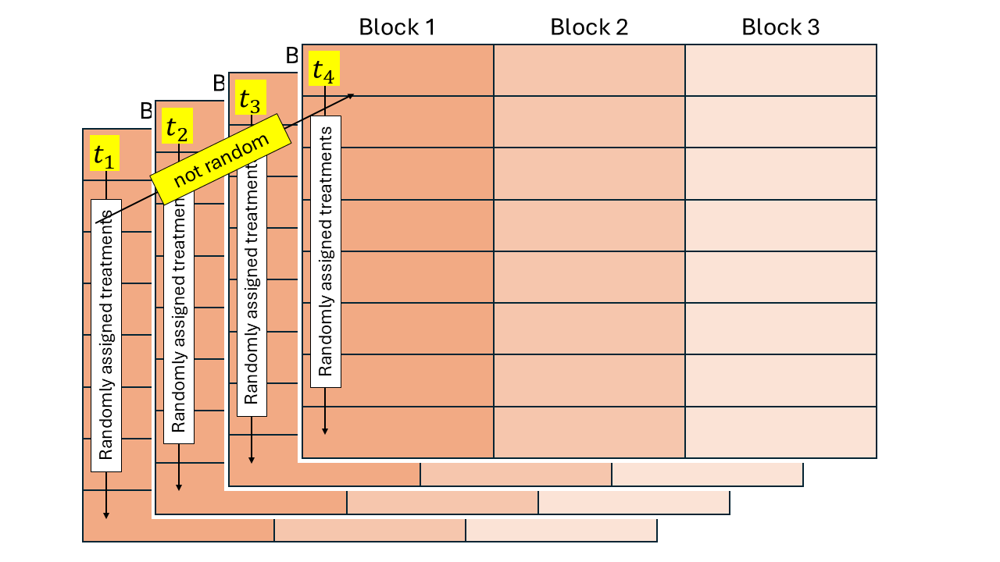

# Repeated Measures II 

## Announcements 

- Zoom classes on 10/13 and 10/15. 

## Linear mixed models review 

Consider the vector notation 

$$\mathbf{y} \sim MVN(\mathbf{X}\boldsymbol{\beta}, \mathbf{V}),$$
where:

- $\mathbf{y}$ is the vector of the response, 
- $\mathbf{X}$ is the model matrix (often containing treatment allocation), 
- $\boldsymbol{\beta}$ is a vector containing the estimates for the effects of all variables in $\mathbf{X}$, 
- $\mathbf{V}$ is the variance covariance matrix for $\mathbf{y}$. 

The specific form of $\mathbf{V}$ depends on the design. 
For mixed models, the linear predictor is 
$$\mathbf{y} = \mathbf{X}\boldsymbol{\beta} + \mathbf{Z}\boldsymbol{u} + \boldsymbol{\varepsilon}, \\
\boldsymbol{u}\sim N(\boldsymbol{0}, \mathbf{G}) \\
\boldsymbol{\varepsilon}\sim N(\boldsymbol{0}, \mathbf{R}),$$
where $\mathbf{Z}$ is the matrix including the information about the random effects and $\boldsymbol{u}$ is the vector of the random effects. 
The marginal distribution of $\mathbf{y}$ for a normal distribution is then 
$$\mathbf{y} \sim MVN(\mathbf{X}\boldsymbol{\beta}, \mathbf{ZGZ}'+\mathbf{R}).$$

Take a look at the variance-covariance matrix below. In this case, all residuals are independent (see yellow diagonal), and all information about groups sharing information is in the G matrix.   

```{r echo=FALSE, fig.cap="Illustrative example of the variance-covariance matrix.", out.width = '100%'}
knitr::include_graphics("../figures/Var_matrix.jpg")
```

Note that, for all mixed models we have been handling so far, 
$$\mathbf{G} = \sigma^2_u\mathbf{I} = 
\begin{bmatrix} 
\sigma^2_u & 0 & 0 & & 0\\
0 & \sigma^2_u & 0 &  & 0\\
0 & 0 & \sigma^2_u &  & 0\\
 &  &  & \ddots & \vdots \\
0 & 0 & 0 & \dots & \sigma^2_u\\
\end{bmatrix},$$
which, will result in the matrix above. 

The conditional distribution of $\mathbf{y}$ is 
$$\mathbf{y} \vert \boldsymbol{u} \sim MVN(\mathbf{X}\boldsymbol{\beta}+\mathbf{Z}\boldsymbol{u}, \mathbf{R}).$$

This conditional distribution comes most handy for non-normal data, 

$$\mathbf{y} \vert \boldsymbol{u} \sim P(\mathbf{X}\boldsymbol{\beta}+\mathbf{Z}\boldsymbol{u}, \mathbf{R}).$$

## Repeated measures 


```{r echo=FALSE, fig.cap="Schematic description of a field experiment with repeated measures", out.width = '100%'}

```

### Correlation - G side (conditional) and R side (marginal)
 
- Inference implications 
- Power implications 

Applied example in R


### Review -- correlation functions 

Let $\mathbf{v}_{i k}$ be the vector for the $k$th individual under the $i$th vaccine treatment, at the different timepoints of the experiment. 

$$\mathbf{v}_{i k} \sim MVN(\boldsymbol{0}, \boldsymbol{\Sigma}_{ik})$$

**Independent observations** 

$$\boldsymbol{\Sigma}_{ik} =
\sigma^2 
\begin{bmatrix}
1 & 0 & 0 & 0 & 0 \\
0 & 1 & 0 & 0 & 0 \\
0 & 0 & 1 & 0 & 0 \\
0 & 0 & 0 & 1 & 0 \\
0 & 0 & 0 & 0 & 1\\
\end{bmatrix}$$


**Compound symmetry** 


$$\boldsymbol{\Sigma}_{ik} =
\sigma^2 
\begin{bmatrix}
1 & \rho & \rho & \rho & \rho \\
\rho & 1 & \rho & \rho & \rho \\
\rho & \rho & 1 & \rho & \rho \\
\rho & \rho & \rho & 1 & \rho \\
\rho & \rho & \rho & \rho & 1\\
\end{bmatrix}$$

This could mean 
$$\mathbf{G}_{ik} =
\sigma_v^2 
\begin{bmatrix}
1 & \rho & \rho & \rho & \rho \\
\rho & 1 & \rho & \rho & \rho \\
\rho & \rho & 1 & \rho & \rho \\
\rho & \rho & \rho & 1 & \rho \\
\rho & \rho & \rho & \rho & 1\\
\end{bmatrix}$$
or
$$\mathbf{R}_{ik} =
\sigma_\varepsilon^2 
\begin{bmatrix}
1 & \rho & \rho & \rho & \rho \\
\rho & 1 & \rho & \rho & \rho \\
\rho & \rho & 1 & \rho & \rho \\
\rho & \rho & \rho & 1 & \rho \\
\rho & \rho & \rho & \rho & 1\\
\end{bmatrix}$$

**AR(1)**

$$\boldsymbol{\Sigma}_{ik} =
\sigma^2 
\begin{bmatrix}
1 & \rho & \rho^2 & \rho^3 & \rho^4 \\
\rho & 1 & \rho & \rho^2 & \rho^3 \\
\rho^2 & \rho & 1 & \rho & \rho^2 \\
\rho^3 & \rho^2 & \rho & 1 & \rho \\
\rho^4 & \rho^3 & \rho^2 & \rho & 1\\
\end{bmatrix}$$

**Unstructured** 

$$\boldsymbol{\Sigma}_{ik} =
\begin{bmatrix}
\sigma^2_{1} & \sigma^2_{12} & \sigma^2_{13} & \sigma^2_{14} & \sigma^2_{15} \\
 & \sigma^2_{2} & \sigma^2_{23} & \sigma^2_{24} & \sigma^2_{25} \\
 &   & \sigma^2_{3} & \sigma^2_{34} & \sigma^2_{35} \\
  &  &  & \sigma^2_{4} & \sigma^2_{45} \\
 &  &  &  & \sigma^2_{5} \\
\end{bmatrix}$$


