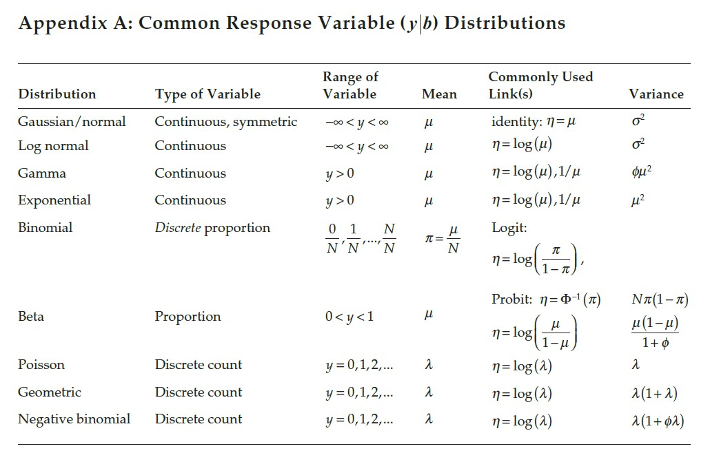

# Repeated Measures III 

## Announcements 

- Zoom classes on 10/13 and 10/15. 
- Assignment 4 due Wednesday. 

## Where we're standing in this course  

Considering the linear mixed model 

$$\mathbf{y} \sim N(\mathbf{X}\boldsymbol{\beta}, \mathbf{V}),$$
where:

- $\mathbf{y}$ is the vector of the response, 
- $\mathbf{X}$ is the model matrix (often containing treatment allocation), 
- $\boldsymbol{\beta}$ is a vector containing the estimates for the effects of all variables in $\mathbf{X}$, 
- $\mathbf{V}$ is the variance covariance matrix for $\mathbf{y}$. 

The marginal distribution of $\mathbf{y}$ for a normal distribution can also be written as 
$$\mathbf{y} \sim MVN(\mathbf{X}\boldsymbol{\beta}, \mathbf{ZGZ}'+\mathbf{R}).$$

The variance-covariance matrices below represent the variance/covariance of all $y$s.   

```{r echo=FALSE, fig.cap="Illustrative example of the variance-covariance matrix.", out.width = '100%'}

```

We consider **messy data** the different dependence patterns in $\mathbf{G}$ and/or $\mathbf{R}$. 

Note that, for all mixed models we have been handling so far, 
$$\mathbf{G} = \sigma^2_u\mathbf{I} = 
\begin{bmatrix} 
\sigma^2_u & 0 & 0 & & 0\\
0 & \sigma^2_u & 0 &  & 0\\
0 & 0 & \sigma^2_u &  & 0\\
 &  &  & \ddots & \vdots \\
0 & 0 & 0 & \dots & \sigma^2_u\\
\end{bmatrix},$$
which, will result in some variation of the matrix above. 


## Repeated measures 


```{r echo=FALSE, fig.cap="Schematic description of a field experiment with repeated measures", out.width = '100%'}
knitr::include_graphics("../figures/designs_repeated.PNG")
```

## Correlation - G side (conditional) and R side (marginal)
 
- Typically, `REPEATED` (in SAS's `MIXED` procedure) is equivalent to R-side (marginal) covariance in `GLIMMIX`. 
- Look at marginal variance-covariance matrix on the board. 
- What happens if we model G-side covariance? 

**Implications on inference** 

- Similar CI for marginal means (lsmeans)  
- Confidence intervals estimated with different DF approximations 
- May see some discrepancy in test statistics. 


## Repeated measures in GLMMs 

Recall distributions of non-Gaussian GLMMs:


```{r echo=FALSE, fig.cap="Common variable distributions. Page 60 in Stroup et al. (2024)", out.width = '80%', fig.align='center'}

```

---
title: "Common Response Variable Distributions"
output: html_document
---

## Appendix A: Common Response Variable (\(y | b\)) Distributions

Below is a table of commonly used distributions, their properties, and related probability density functions (PDFs).

<head>
    <meta charset="UTF-8">
    <meta name="viewport" content="width=device-width, initial-scale=1.0">
    <title>GLMMs</title>
    <style>
        .table-wrapper {
            width: 100%; 
            overflow-x: auto; 
            border: 1px solid #ccc; 
        }
        table {
            width: 100%;
            border-collapse: collapse;
            margin: 20px 0;
        }
        th, td {
            border: 1px solid #ddd;
            padding: 8px;
            text-align: left;
        }
        th {
            background-color: #f4f4f4;
            font-weight: bold;
        }
        tr:nth-child(even) {
            background-color: #f9f9f9;
        }
    </style>
</head>

<body>

<div class = "table-wrapper">
<table>
  <thead>
    <tr>
      <th><b>Distribution</b></th>
      <th><b>Range of Variable</b></th>
      <th><b>Mean</b></th>
      <th><b>Commonly Used Link(s)</b></th>
      <th><b>Variance</b></th>
      <th><b>PDF</b></th>
    </tr>
  </thead>
  <tbody>
    <tr>
      <td>Gaussian/normal</td>
      <td>\(-\infty < y < \infty\)</td>
      <td>\(\mu\)</td>
      <td>\(\eta = \mu\)</td>
      <td>\(\sigma^2\)</td>
      <td>$$f(y) = \frac{1}{\sqrt{2\pi \sigma^2}} e^{-\frac{(y-\mu)^2}{2\sigma^2}}$$</td>
    </tr>
    <tr>
      <td>Log normal</td>
      <td>\(-\infty < y < \infty\)</td>
      <td>\(\mu\)</td>
      <td>\(\eta = \log(\mu)\)</td>
      <td>\(\sigma^2\)</td>
      <td>$$f(y) = \frac{1}{y\sigma\sqrt{2\pi}} e^{-\frac{(\log y - \mu)^2}{2\sigma^2}}$$</td>
    </tr>
    <tr>
      <td>Gamma</td>
      <td>\(y > 0\)</td>
      <td>\(\mu\)</td>
      <td>\(\eta = \log(\mu), \frac{1}{\mu}\)</td>
      <td>\(\phi \mu^2\)</td>
      <td>$$f(y) = \frac{y^{\frac{\mu}{\phi} - 1} e^{-\frac{y}{\phi}}}{\phi^{\mu} \Gamma(\mu)}$$</td>
    </tr>
    <tr>
      <td>Exponential</td>
      <td>\(y > 0\)</td>
      <td>\(\mu\)</td>
      <td>\(\eta = \log(\mu), \frac{1}{\mu}\)</td>
      <td>\(\mu^2\)</td>
      <td>$$f(y) = \frac{1}{\mu} e^{-\frac{y}{\mu}}$$</td>
    </tr>
    <tr>
      <td>Binomial</td>
      <td>0, \(\frac{1}{N}, \dots, \frac{N}{N}\)</td>
      <td>\(\pi = \frac{\mu}{N}\)</td>
      <td>Logit: \(\eta = \log\left(\frac{\pi}{1-\pi}\right)\)</td>
      <td>\(N\pi(1-\pi)\)</td>
      <td>$$f(y) = \binom{N}{y} \pi^y (1-\pi)^{N-y}$$</td>
    </tr>
    <tr>
      <td>Beta</td>
      <td>0 < \(y < 1\)</td>
      <td>\(\mu\)</td>
      <td>\(\eta = \log\left(\frac{\mu}{1-\mu}\right)\)</td>
      <td>\(\frac{\mu(1-\mu)}{1+\phi}\)</td>
      <td>$$f(y) = \frac{y^{\alpha-1}(1-y)^{\beta-1}}{B(\alpha, \beta)}$$</td>
    </tr>
    <tr>
      <td>Poisson</td>
      <td>\(y = 0, 1, 2, \dots\)</td>
      <td>\(\lambda\)</td>
      <td>\(\eta = \log(\lambda)\)</td>
      <td>\(\lambda\)</td>
      <td>$$f(y) = \frac{\lambda^y e^{-\lambda}}{y!}$$</td>
    </tr>
    <tr>
      <td>Geometric</td>
      <td>\(y = 0, 1, 2, \dots\)</td>
      <td>\(\lambda\)</td>
      <td>\(\eta = \log(\lambda)\)</td>
      <td>\(\lambda(1+\lambda)\)</td>
      <td>$$f(y) = (1-\lambda)^y \lambda$$</td>
    </tr>
    <tr>
      <td>Negative binomial</td>
      <td>\(y = 0, 1, 2, \dots\)</td>
      <td>\(\lambda\)</td>
      <td>\(\eta = \log(\lambda)\)</td>
      <td>\(\lambda(1+\phi\lambda)\)</td>
      <td>$$f(y) = \binom{y + r - 1}{y} \lambda^r (1-\lambda)^y$$</td>
    </tr>
  </tbody>
</table>
</div>

If we describe a non-Gaussian GLMM with 

$${y}|\boldsymbol{u} \sim P({\mu}, \phi),$$
where $y$ is the response, $\boldsymbol{u}$ are the random effects, $\mu$ is the mean, and $\phi$ is the dispersion, 
we know that $\mu$ and $\phi$ may not be independent. 

- G-side ~ 'true GLMM' 
- R-side: quasi-likelihood models 
- Marginal models often lead to less powerful tests.
- Several discussions:
  - Philosophical, Power, and more [Lee and Nelder (2004)](https://projecteuclid.org/journals/statistical-science/volume-19/issue-2/Conditional-and-Marginal-Models-Another-View/10.1214/088342304000000305.full) 
  - Many unknowns for the software implementation of non-Gaussian GLMMs [Stroup and Claassen (2020)](jstor.org/stable/48736894) 

## Applied example using R  

[Get R code](../scripts/10062025_inclass_rm.Rmd)


