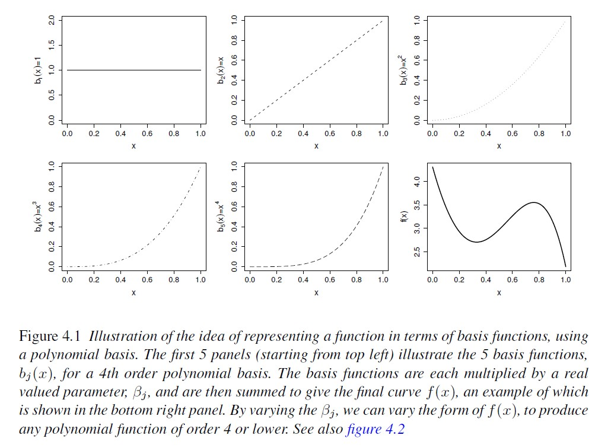

# Smoothing Splines  

## Announcements

- Comments on Assignment 4 
- Assignment 5 is due this Friday

## Non-parametric tools

- Minimize/relax assumptions 
- No free lunches! 
  - Interpretability 
  - bias-variance tradeoff 

### Splines 

- Splines are special cases of non-parametric tools. 
- Introduced in the sixties [(Schoenberg, 1964)](https://www.jstor.org/stable/pdf/72390.pdf) 
- They provide a flexible tool to model the variability in the data, where the functional (~ "the shape") is unknown 

Polynomials: 

- good for local approximation 
- bad for global approximation


We can represent the data with the equation 
$$y_i = \beta_0 + g(x_i) + \varepsilon_i, \\ \varepsilon_i \sim N(0, \sigma^2),$$
where 

- $g(x_i) = \sum_{i=1}^k B_i^m(x) \beta_i$. 

- B-splines  
  - minimize $\sum_{i=1}^n \left\{ y_i - (\mathbf{x}_i'\boldsymbol{\beta}_x + \mathbf{B}^T(\mathbf{x}_i) \boldsymbol{b}) \right\}^2$ 
- Penalized splines 
  - low rank smoothers using a B-spline basis
  - minimize $\sum_{i=1}^n \left\{ y_i - (\mathbf{x}_i'\boldsymbol{\beta}_x + \mathbf{B}'(\mathbf{x}_i) \boldsymbol{b}) \right\}^2 + \lambda \boldsymbol{b}'\mathbf{D}\boldsymbol{b}$ 
- Cyclic splines 

## Thin-plate regression splines 

- Origin of the name "thin-plate" 
- radial basis functions 
- supports multiple predictor variables (unlike other basis)  
- avoid the problem of knot placement 
- not so computationally costly, but may become more relevant for large data (scaling $O(k^3)$) 
- basis functions and basis funciton dimension 
- See Chapter 5 in Wood (2017) 

In thin-plate regression, we can represent the data with the equation 
$$y_i = \beta_0 + g(\mathbf{x}_i) + \varepsilon_i, \\ \varepsilon_i \sim N(0, \sigma^2),$$
where $\mathbf{x}_i$ is a $d-$vector with the predictors. 
Thin-plate smoothers estimate $g(\cdot)$ by finding the $\hat{f}(\cdot)$ that minimizes 
$$||\mathbf{y} - \mathbf{f}||^2 + \lambda J_{md}(f),$$
where: 

- $\mathbf{y}$ is the vector of observations, 
- $\mathbf{f} = [f(\mathbf{x}_1), f(\mathbf{x}_2), \dots, f(\mathbf{x}_n)]^T$, 
- $J_{md}(f)$ is penalty functional affecting the 'wiggliness' of $f$ 
- $\lambda$ is a smoothing parameter controlling the tradeoff between data fitting and smoothness of $f$ 

```{r echo=FALSE, fig.cap="From Wood (2007)", out.width = '80%', fig.align='center'}

```


```{r}
x <- seq(1, 50, by = 1)
set.seed(42)
y <- 15 + 15*sin(sqrt(x*.15  - x*.006))+ rnorm(length(x), 0, 1.5)
plot(x, y)

splines_df <- data.frame(x, y)
m_spline_tp <- gam(y ~ s(x, bs = "tp", k = 7), method = "REML", data = splines_df)

splines_df$bs_spline <- predict(m_spline_tp, type = "response")
splines_df$bs_spline_se <- predict(m_spline_tp, type = "response", se.fit = T)$se.fit

knots <- m_spline_tp$smooth[[1]]$knots

coef(m_spline_tp)[grep("s\\(x\\)", names(coef(m_spline_tp)))]
```
```{r}
beta_smooth <- coef(m_spline_tp)[grep("s\\(x\\)", names(coef(m_spline_tp)))]

Xp <- predict(m_spline_tp, type = "lpmatrix")  # each column = basis function

# Remove intercept column for plotting
Xp_smooth <- Xp[, grep("s\\(x\\)", colnames(Xp))]

# Plot basis functions
matplot(x, Xp_smooth, type = "l", lty = 1, col = rainbow(ncol(Xp_smooth)),
        main = "Spline Basis Functions", xlab = "x", ylab = "Basis value")

# Add contribution from each basis function
# multiply basis functions by their contribution 
y_basis <- sweep(Xp_smooth, 2, beta_smooth, "*")
matplot(x, y_basis, type = "l", lty = 1, col = rainbow(ncol(Xp_smooth)),
        main = "Contribution of Each Basis Function", xlab = "x", ylab = "Contribution")
```

```{r}
df_basis <- as.data.frame(cbind(x, Xp_smooth)) %>% 
  pivot_longer(cols = `s(x).1`:`s(x).6`)

splines_df %>% 
  ggplot(aes(x, y))+  
  geom_line(aes(y = 18 + value*10, 
                group = name, 
                color = name),
            show.legend = F,
            data = df_basis, 
            alpha = .6)+
  theme_classic()+
  theme(panel.border = element_blank(), 
        panel.grid = element_blank())+
  geom_vline(aes(xintercept = knots), data = data.frame(knots), linetype = 2)+
  geom_line(aes(y = bs_spline+(bs_spline_se*1.96)), linetype = 2)+
  geom_line(aes(y = bs_spline-(bs_spline_se*1.96)), linetype = 2)+
  geom_line(aes(y = bs_spline))+
  coord_cartesian(xlim = c(0, 50))+
  labs(x = "Columns (x1)", y = "y or f(x1)")+
  geom_point()
```

```{r}
matplot(x, rowSums(y_basis), type = "l", lty = 1, col = rainbow(ncol(Xp_smooth)),
        main = "Sum of the contributions of all basis functions", xlab = "x", ylab = "f(x)")
```


## Final comments 

- Generalized additive models 
- Choosing parametric vs. semi-parametric 
- Choosing types of splines 
  - B-splines 
  - P-splines 
  - Thin-plate splines 
- Model selection 
- G-side vs. R-side discussion 


## Resources 

- Wood, S.N. (2017). Generalized Additive Models. Chapman and Hall/CRC. [[link](https://www.taylorfrancis.com/books/mono/10.1201/9781315370279/generalized-additive-models-simon-wood)] 
- Ruppert, D. (2004). Nonparametric Regression and Splines. In: Statistics and Finance. Springer Texts in Statistics. Springer, New York, NY. [https://doi.org/10.1007/978-1-4419-6876-0_13](https://doi.org/10.1007/978-1-4419-6876-0_13)
