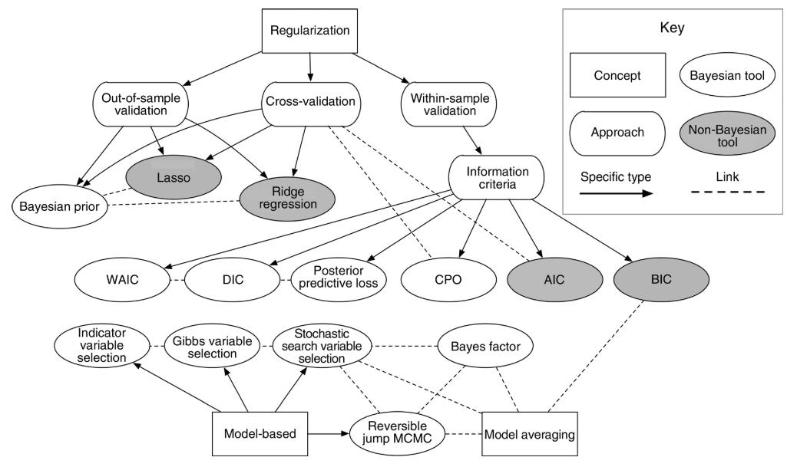

# Model selection II

## Announcements 

- Project deadlines:
  - **December 5th:** return your peer review to your classmate(s).
  - **December 12th:** give your presentation by this date (it can be earlier than this also). You will need to schedule a 30min meeting with me. 
  - **December 19th:** submit your final project and tutorial on canvas, including both your classmate's and my feedback.

## Model selection 

- Review: building a statistical model 
- Models for data generated by designed experiments
- Convergence issues in models for data generated by designed experiments 
- Loss functions 

> What is a model? Using word association, an obvious matchto model is airplane. We are all familiar with model airplanes,which come in a variety of shapes, sizes, and prices. Theessential feature of a model airplane is that it is simpler andcosts less but nonetheless captures some relevant features of areal airplane. Scientific and statistical models are simplifi-cations of the world around us, which is why we use the wordmodel in the same way as for model airplanes. Like modelairplanes, scientific models can come in a variety of forms andsizes, ranging from a simple average of data, to global climatemodels. Because models have variety, it is natural to considerwhen models are good or useful (Box 1976, Box and Draper1987:74, 424), which naturally leads to considering when 1model is better than another, and indeed searching for thebest model, or combination of models. The search, then, is animportant part of overall inference, i.e., how that searchaffects the global uncertainty, risk, and the probability ofmaking errors. 
> 
> From Ver Hoef and Boveng (2015) 

**Model selection in other contexts**  

```{r echo=FALSE, fig.cap="Figure 2 in Hooten and Hobbs (2015)", out.width = '80%', fig.align='center'}

```


## Applied examples 

[Get R code](../scripts/12012025_model_selection.Rmd) 


## Next week 

- Experiment design 
- Bayesian analyses of designed experiments 
