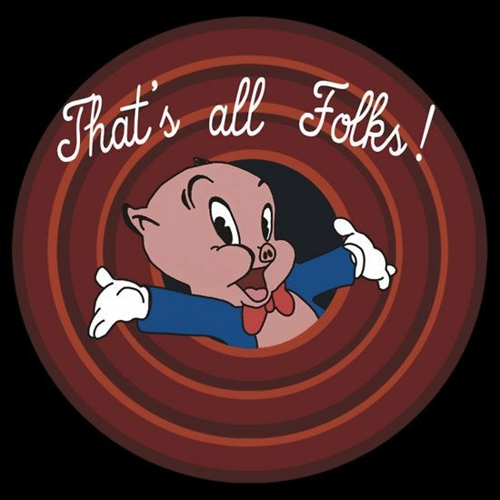

# Bayesian analysis of data generated by designed experiments 

## Announcements 

- Project deadlines:
  - **December 12th:** give your presentation by this date (it can be earlier than this also). You will need to schedule a 30min meeting with me. 
  - **December 19th:** submit your final project and tutorial on canvas, including both your classmate's and my feedback.

## Applied example 

Suppose we designed an experiment with the rationale outlined above. What if the model doesn't converge?

- About dropping effects from the model 
- Bayesian solutions 

```{r message=FALSE, warning=FALSE}
library(glmmTMB)
library(ggpubr)
```

```{r}
dat <- readxl::read_xlsx("../../data_confid/Behavior_Counts.xlsx")

# viz
dat |> 
  ggplot(aes(timepoint, behavior_count))+
  geom_line(aes(group = calfID, 
                color = breed))+
  geom_point(aes(group = breed, 
                 fill = breed),
             shape =21, size= 2.5)+
  facet_wrap(~trt)+
  scico::scale_fill_scico_d()+
  scico::scale_color_scico_d()+
  theme_pubclean()
```


```{r}
m2 <- glmmTMB(behavior_count ~ timepoint * trt * breed +
                toep(timepoint + 0 | calfID),
              ziformula = ~1,
              family = poisson(link = "log"),
              data = dat |> mutate(timepoint_f=as.factor(timepoint)))
```

What to do? 

[Link to R code](../scripts/12082025_stan_desexp.Rmd)


```{r echo=FALSE, fig.cap="That's all!", out.width = '80%', fig.align='center'}

```


