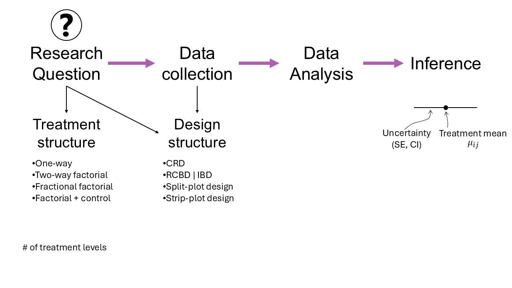
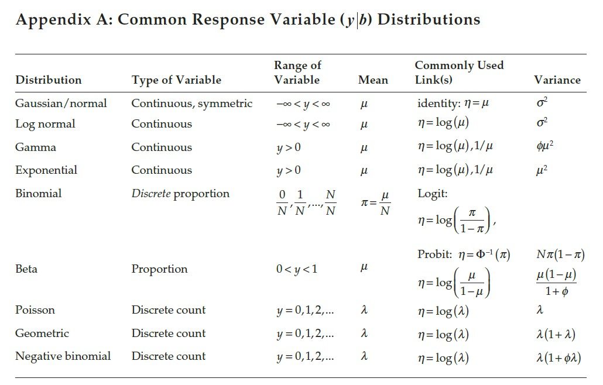

--- 
title: "STAT 870 - Analysis of Messy Data"
author: "Josefina Lacasa"
date: Fall 2025 #"`r Sys.Date()`"
site: bookdown::bookdown_site
---

# Welcome to STAT 870!  
August 25th, 2025  

## About this course:  

- [About me](https://jlacasa.github.io/) 
- About you: 

```{r echo=FALSE, message=FALSE, warning=FALSE}
library(tidyverse)
read.csv("../../students_STAT_870_A.csv") %>%
  filter(degreeProgram != "") %>% 
  ggplot(aes(x = degreeProgram))+
  geom_bar(fill = "#B388EB")+
  theme_bw()+
  theme(panel.grid.minor = element_blank(),
        panel.border = element_blank(),
        axis.title.x = element_blank(),
        axis.text.x = element_text(angle = 50, vjust = 1, hjust=1))
```

- In rounds: What's your major and what do you expect to learn in 870?  

### Logistics  

- [Website](#)
- Syllabus 
- Statistical programming requirements  
- Rough mindmap of the course (on whiteboard)  
- [Semester project - analyze your own experiment.](#)   
- Reproducible tutorial 
- Grades: A (100-89.999999999(!!!)), B (89.99-79.99), C (79.99-69.99), D (69.99-59.99), F (<59.99).
- Attendance policies & kahoots  

## Learning goals   

By the end of this course, you should be able to:  
- Identify the treatment design, experiment design, experimental unit and observational unit of simple and complex designed experiments.  
- Distinguish the benefits/disadvantages of different experiment designs.  
- Write the statistical model that corresponds to data generated by designed experiments.  
- Write the Materials and Methods section in a paper (or thesis) that describes the designed experiment.  

## Overview of the course 

```{r echo=FALSE, fig.cap="Mindmap", out.width = '80%', fig.align='center'}

```

## What is messy data anyways?

- Complex dependence structures 
- Complex structure in covariates 

## Linear Models review 

Perhaps the most common model of all time (default in most software) is 

$$y_{i} = \mu_i + \varepsilon_i, \ \varepsilon_i \sim N(0, \sigma^2),$$

where: 

- $y_{i}$ is the observed value for the $i$th observation, 
- $\mu_i$ is the expected value for the $i$th observation, 
- $\varepsilon_i$ is the residual (i.e., the difference between observed and expected). All residuals are iid normal.  
This example uses the model equation form. 

The model above can also be written usign the probability distribution form. The probability distribution form is much more flexible because it is compatible with other distributions beyond the normal. It goes like this:

$$y_{i} \sim N(\mu_i, \sigma^2),$$
where the elements are the same as described above. 

Likewise, we can use the vectorized notation of the probability distribution form, and say that 

$$\mathbf{y} \sim N(\boldsymbol\mu, \sigma^2 \mathbf{I}),$$
where: 

- $\mathbf{y} \equiv [y_1, y_2, ..., y_n]'$ is the vector of observed values, 
- $\boldsymbol\mu \equiv [\mu_1, \mu_2, ..., \mu_n]'$ is the vector of expected values, 
- $\sigma^2 \mathbf{I}$ is the variance-covariance matrix. Note that, more generally, we can call the variance-covariance matrix $\boldsymbol{\Sigma}$ or $\mathbf{V}$. 


Note that
$$\sigma^2 \mathbf{I} = \sigma^2 \begin{bmatrix} 
1 & 0 & 0 & \dots & 0 \\
0 & 1 & 0 & \dots & 0 \\
0 & 0 & 1 & \dots & 0 \\
\vdots & \vdots & \vdots & \ddots & \vdots \\
0 & 0 & 0 & \dots & 1 \end{bmatrix}
= \begin{bmatrix} 
\sigma^2 & 0 & 0 & \dots & 0 \\
0 & \sigma^2 & 0 & \dots & 0 \\
0 & 0 & \sigma^2 & \dots & 0 \\
\vdots & \vdots & \vdots & \ddots & \vdots \\
0 & 0 & 0 & \dots & \sigma^2 \end{bmatrix}.$$

The assumptions behind this model are:

- Normal distribution of the data 
- Constant variance 
- Independence 
- Linearity 

In this course, we will mostly deal with cases where: 

- The assumption of independence does not hold (basic and complex designed experiments), 
- The assumption of normality does not make sense (e.g., data are counts, proportions, or stricly positive), 
- The assumption of constant variance does not hold/make sense (e.g., larger biomass is associated to larger variance of said biomass). 

We will approach most problems with a 3-step approach (Chapter 2 in Stroup et al.): 

- What is the distribution of the data? 
- What is the link function? 
- What is the blueprint of the design/data? 

```{r echo=FALSE, fig.cap="Common variable distributions. Page 60 in Stroup et al. (2024)", out.width = '80%', fig.align='center'}

```

## On notation  

- scalars: $y$, $\sigma$, $\beta_0$  
- vectors: $\mathbf{y} \equiv [y_1, y_2, ..., y_n]'$, $\boldsymbol{\beta} \equiv [\beta_1, \beta_2, ..., \beta_p]'$, $\boldsymbol{u}$  
- matrices: $\mathbf{X}$, $\Sigma$  
- probability distribution: $y \sim N(0, \sigma^2)$, $\mathbf{y} \sim N(\boldsymbol{0}, \sigma^2\mathbf{I})$.     

## Homework & Announcements  

- Install R and RStudio. 
- Submit [Assignment 1](https://stat870.github.io/fall2025/assignments/Assignment1_YourLastName.pdf) by next Monday. 
- Applied Linear Mixed Models Workshop 

