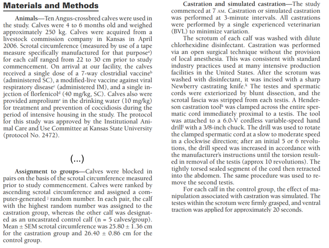
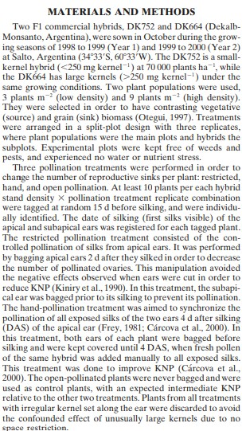

```{r setup, include=FALSE}
knitr::opts_chunk$set(fig.pos = "H", out.extra = "", echo = TRUE)
```

## Goal of this assignment  

The goals of this assignment are to: 

- Review treatment structure and design structure of designed experiments.  
- Analyze data generated by a designed experiment using statistical software. 

Please complete exercises (1) and (2), rename the `Rmd` file to "Assignment2_YourLastName.Rmd" (e.g., "Assignment2_Smith.Rmd"), your name in the header, and knit the Rmd to an html file or pdf file. Please submit that html or pdf file on CANVAS by Wednesday, September 10th by midnight. You may work in pairs, but each one of you will have to submit your own file. 

**Formatting**: Please make sure that your knitted pdf or html document does not include unnecessary warnings/messages.  
For the statistical models, you can use \LaTeX code embedded in your Rmd, or paste a picture. You can check the raw Rmd files from the lectures (including \LaTeX code) at [https://github.com/stat870/fall2025/tree/main/_notes](https://github.com/stat870/fall2025/tree/main/_notes). Otherwise, you can check out the [Rmd cheatsheet](https://rstudio.github.io/cheatsheets/html/rmarkdown.html) or the `knitr::include_graphics()` function. 

## 1. 

Below are two snippets from Materials and Methods sections from peer-reviewed papers. Identify the treatment structure and design structure for both, or mention if this information is unclear or unavailable. 

### 1a. 

From "Plasma concentrations of substance P and cortisol in beef calves after castration or simulated castration" - Coetzee et al. (2008) [[link to paper](https://avmajournals.avma.org/view/journals/ajvr/69/6/ajvr.69.6.751.xml)] 

```{r echo=FALSE, fig.cap="From Coetzee et al. (2008)",fig.align='center', out.width = '90%'}

```

### 1b. 

From "Maize Kernel Weight Response to Postflowering Source–Sink Ratio" - Borras and Otegui (2001) [[link to paper](https://acsess.onlinelibrary.wiley.com/doi/abs/10.2135/cropsci2001.1816)]

```{r echo=FALSE, fig.cap="From Borras and Otegui (2001)",fig.align='center', out.width = '55%'}

```

## 2. 

The data in the code below correspond to a trial studying the effects of agronomic management and the timing of said agronomic management on plant height in rice. 
Studying plant height in rice is important because this trait is associated to lodging (i.e., when the plants are too tall and heavy and "fall"), which may reduce yields due to difficulty harvesting the grain. 

The scientists were able to divide the field into equally-sized blocks that fitted all treatments (i.e., *complete blocks*). 
Then, the scientists randomly allocated the management treatments to smaller areas within the blocks. 
After that, they assigned the timings to even smaller areas of the management treatments. 
From each block-management-timing treatment combination, they were able to measure plant height twice. 

### 2a. 

**What is the treatment structure and the design structure in this experiment?** 

Answer: The treatment structure is a $7\times 3$ factorial, and the design structure is a split-plot design with subsampling. 

### 2b. 

**Write the statistical model that best represents the data generating process.** 


### 2c. 

Fit that model to the data, check model assumptions, report all variance components, and the estimated marginal means (including some measure of uncertainty) for all time-management combinations (i.e., 32 total combinations). 

```{r warning=FALSE, message=FALSE}
library(agridat)
data("gomez.splitplot.subsample")
df <- gomez.splitplot.subsample
```

```{r}
library(tidyverse)
library(lme4)
library(emmeans)
```

```{r}
m <- lmer(height ~ time*manage + (1|rep/manage/time), data = df)
summary(m)
```

```{r}
options(contrasts = c("contr.sum", "contr.poly"))
m <- lm(height ~ time*manage, data = df)
m <- lmer(height ~ time*manage + (1|rep/manage/time), data = df)
summary(m)

model.matrix(m)

options()
```


